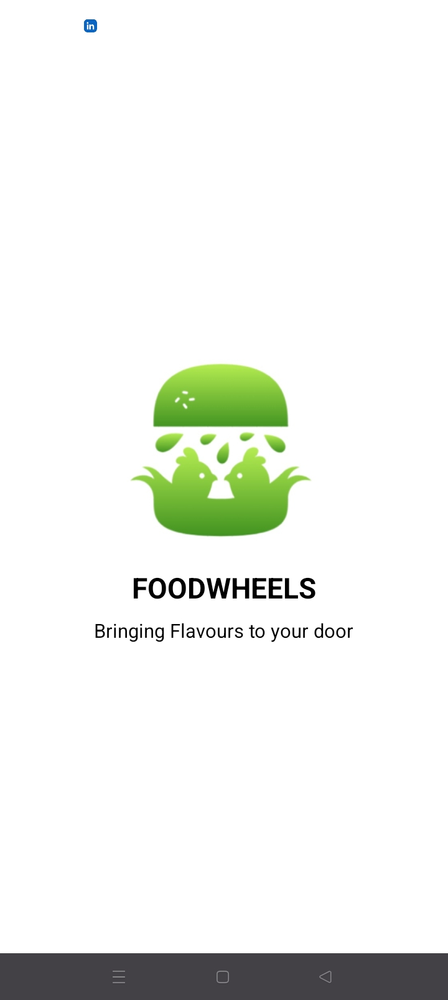
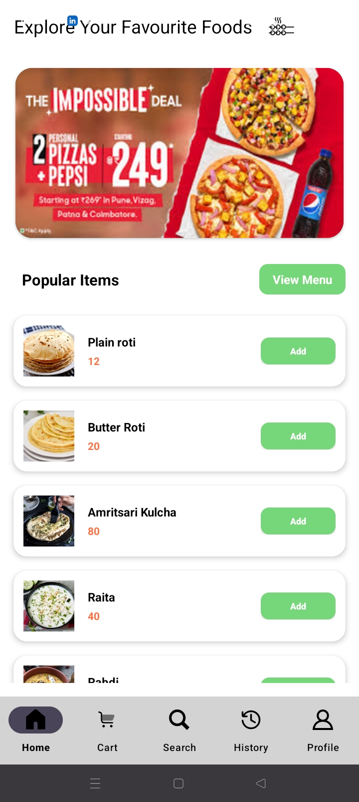
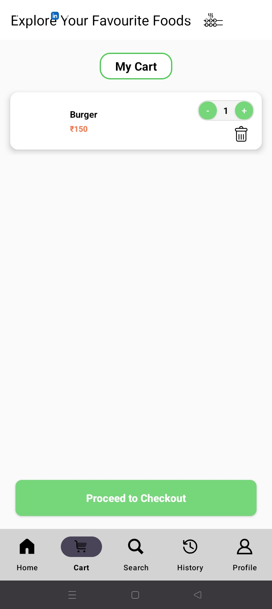
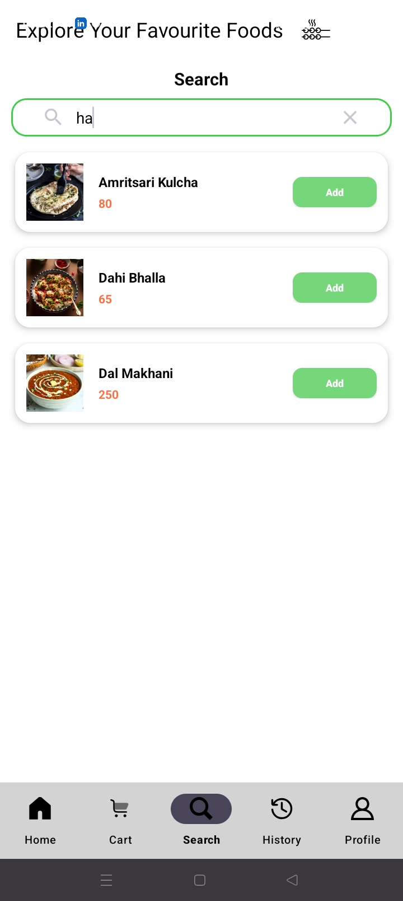
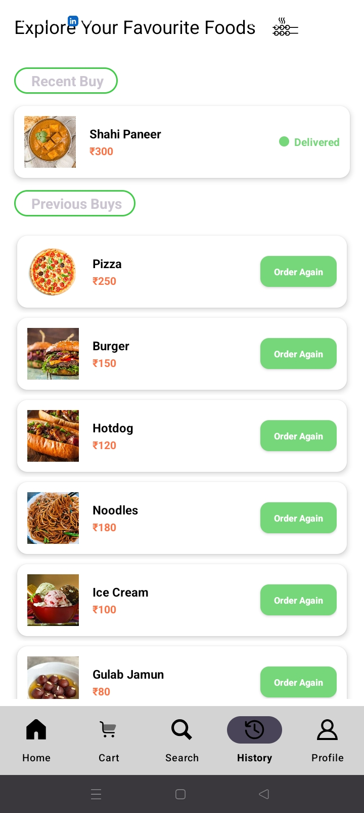
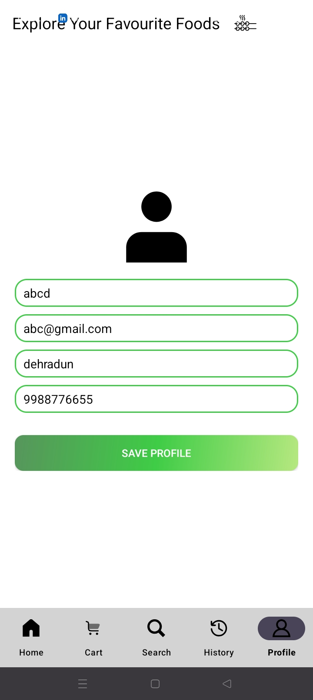
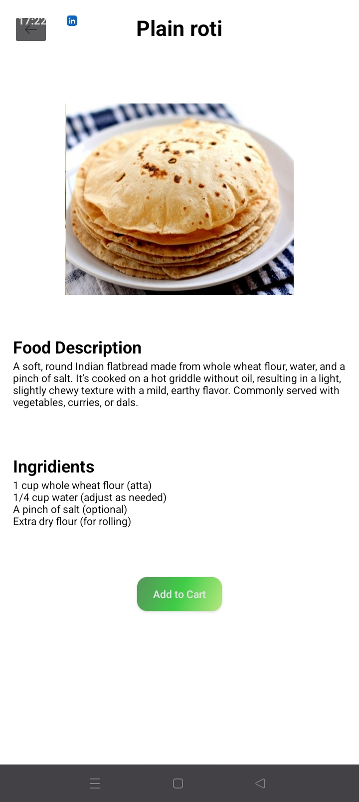

# 🍔 FoodWheels – Two-Way Android Food Ordering System

<div align="center">


A scalable Android-based food ordering ecosystem featuring dedicated applications for customers and administrators, enabling efficient order processing, menu management, and real-time synchronization.

</div>

---

# 📌 Overview

FoodWheels is a two-way Android food ordering platform developed to simplify interactions between customers and administrators.

The system provides dedicated interfaces for users and admins, allowing customers to browse menus, place orders, and track order status while enabling administrators to manage menus, monitor orders, and maintain operational efficiency.

---

# ✨ Features

### 👤 Customer Application

- User Registration & Login
- Browse Food Categories
- Add Items to Cart
- Place Orders
- View Order History
- Track Order Status
- Session Persistence

### 🛠 Administrator Application

- Menu Management
- Add, Edit and Delete Food Items
- Order Monitoring
- Status Updates
- User Management
- Real-Time Order Handling

### ⚡ Real-Time Functionalities

- Firebase Authentication
- Firebase Realtime Database Integration
- Instant Data Synchronization
- Low Latency Updates
- Multi-Session Support

---

# 🏗 System Architecture

```text
Customer Application
         │
         ▼
Firebase Authentication
         │
         ▼
Firebase Realtime Database
         │
         ▼
Administrator Application
```

---

# 🛠 Tech Stack

| Technology | Purpose |
|------------|---------|
| Kotlin | Application Development |
| XML | UI Design |
| Firebase Authentication | User Authentication |
| Firebase Realtime Database | Real-Time Synchronization |
| Android Studio | Development Environment |
| Git | Version Control |
| GitHub | Repository Hosting |

---

# 🚀 Key Functionalities

✔ Secure User Authentication

✔ Role-Based Access Control

✔ Menu Management

✔ Order Placement

✔ Order Tracking

✔ Realtime Database Synchronization

✔ Administrator Dashboard

✔ Session Persistence


---

# 📈 Learning Outcomes

This project strengthened understanding of:

- Android Application Development
- Firebase Authentication
- Realtime Database Management
- State Management
- UI Design using XML
- Client–Server Architecture
- Database Synchronization
- Software Design Principles

---


## 📱 Application Preview

<p align="center">
  <a href="assets/115644.jpg">
    
  </a>
  <a href="assets/115645.jpg">
    
  </a>
  <a href="assets/115646.jpg">
    
  </a>
</p>

<p align="center">
  <a href="assets/115647.jpg">
    
  </a>
  <a href="assets/115648.jpg">
    
  </a>
  <a href="assets/115649.jpg">
    
  </a>
</p>

<p align="center">
  <a href="assets/115650.jpg">
    
  </a>
</p>

<p align="center">
  <i>Click any screenshot to view it in full resolution.</i>
</p>


---
# 👨‍💻 Author

### Vaibhav Khandelwal

Computer Science Engineering Student

📧 vaibhavkhandelwal2408@gmail.com

🔗 LinkedIn  
https://www.linkedin.com/in/vaibhavkhandelwal-cse/

🔗 GitHub  
https://github.com/VAIBHAVKHANDELWA

---

⭐ If you found this project interesting, consider giving it a star.
